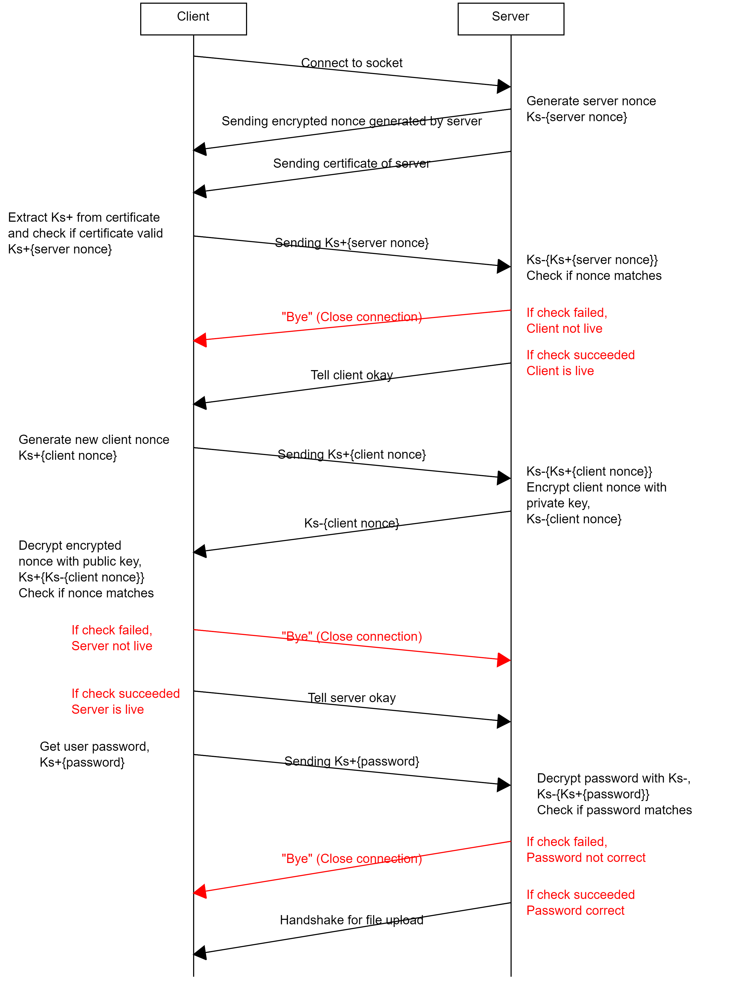
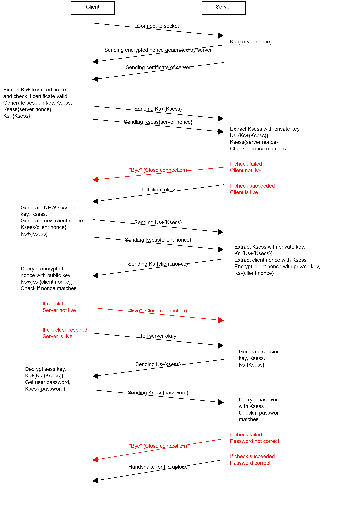

# Programming Assignment 2 - Secure File Transfer
## Github link : [https://github.com/moobshake/50005---PA2---File-Transfer](https://github.com/moobshake/50005---PA2---File-Transfer)
## Pair Details:
- Lau Yu Hui, 1004410
- Tan Jing Heng Darryl, 1004152
## How to Run:
NOTE - We used java version 15.0.2  
1. cd to each of the 'Client' and 'Server'.
2. run 'java ./ServerCP1.java' and 'java ./ClientCP1.java' (can run CP2, just change the filename)
3. Follow the prompts in the programs to change port number or address
4. After connecting, the checking of whether both server and client are live will be automatically done. You just have to enter the password, "csebestmod", in the client side. 
5. After server authenticates, you can start sending the data. Before sending, ensure that the files are in the client folder.
### For CP2:
There are more avaliable actions such as:  
1. Sending files  
2. Listing files in server
3. Downloading files from server
4. Deleting files from server
5. Quiting the program  

To do all these, just follow the prompts in the program.
# Report
The problem of the given authentication protocol is that it is susceptable to Replay attack such that, the HACKERMAN can manipulate the transferring of data. You can see in the diagram below that at any point in time, the HACKERMAN can change the certificate or get the data of both the server and client thus it is not really safe:  

So there are 3 problems that we face here:
1. Server does not know if client is live.
2. Client does not know if server is live.
3. Server does not know if client should have access to the database.

For problem 1 and 2, we just need to use NONCE generated by Client and Server. For problem 3, we implemented a password system to solve the issue.
## Authentication protocol for CP1

## Authentication protocol for CP2
For CP2, there is the use of session key to send and receive data which will make file transfer faster and there is a similar authentication protocol but with more steps. The session key will be encrypted by either the public key or private key depending on who is generating and sending the session key. You can view it in the diagram below:

NOTE: For every instruction sent by the client after the handshake, **NEW** session key will be generated and sent to the server.
## Performance analysis
As we can see from the graph below, the time taken to transfer the files of smaller sizes have a negligible difference for CP1 and CP2. However, as the size of the files increase, we can see that CP1 takes significantly longer than CP2. This might be because the key used in CP1 is 2048 bits as opposed to the 128 bit key used in CP2, meaning that in CP1 there would be more bits to decrypt. As the file size increases, the queueing delay becomes more significant, resulting in a large overall time taken to transfer the file.

# Things to note for PacketTypes:
### Client
>- 33 : File transfer   successful
>- 55 : Server rejected client connection
>- 88 : Server accepted client connection
>- 111 : Password is correct
>- 222 : Password is wrong
### Server
>- -44: Authentication
>- 0 : Get FileName  
>- 1 : Get Packets  
>- 22 : Recieve Session Key
>- 44 : End client connection
>- 55 : Client say server is fake  
>- 88 : Client say sever is real
## Only for CP2
### Client
>- 999 : All packets are recieved when downloading gfiles from server
>- 1009 : Receiving filenames from server when getting filenames  
>- 1010 : No files in server when get filenames  
>- 1011 : There are files in server when get filenames  
>- 1012 : Files does not exist in server when trying to download  
>- 1013 : File exists in server and downloading  
>- 1014 : File does not exist in server when trying to delete  
>- 1015 : File exists in server and being deleted
### Server
>- 1002 : Get file names in server folder  
>- 1003 : Client wants to download file from server  
>- 1004 : Client wants to delete file in server
## For Checkoff
- Client CP1:  
authenticateServer - Line 195  
Getting server.crt from server - Line 210  
Verify server.crt - Line 240  
Extract server public key - Line 235  
Encrypt with server public key - Line 157
- Server CP1
Sending server cert - Line 220  
Decrypt file chunks with private key - Line 140 (Called by line 87)
- Client CP2:  
sessionkeyGen() - Line 394  
Generate symkey (For server auth) - Line 480  
Generate symkey (For data) - Line 400  
Send encrypted symkey (For server auth) - Line 512  
Encrypt file chunk with symkey - Line 356  
- Server CP2  
Decrypt symkey with private key - Line 454  
Decrypt file with symkey - Line 319 (Called by line 299)